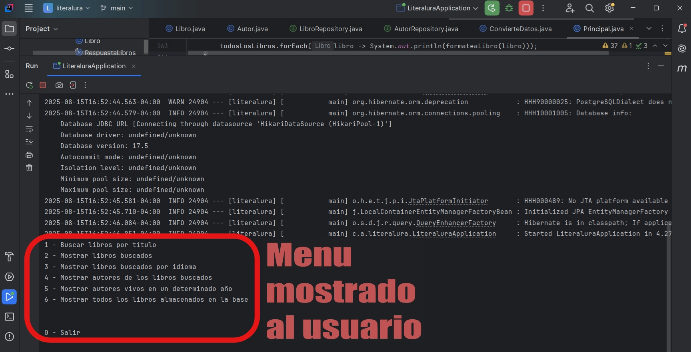

# 📚 Literalura

**Literalura** es una aplicación Java de consola desarrollada con Spring Boot para gestionar libros y autores, consumiendo datos desde la API de [Gutenberg](https://gutendex.com/).  
Permite buscar libros, filtrar por idioma, almacenar autores y consultar autores vivos en un año determinado.

---
## 📦 Tecnologías

- Java 17
- Spring Boot 3
- Hibernate / JPA
- Base de datos relacional (PostgreSQL)
- API externa: [Gutendex](https://gutendex.com/)
- Librerías: `Lombok`, `Jakarta Persistence`

---

## 🏹 Funcionalidades

La clase `Principal` implementa todas las funcionalidades del proyecto:

1. **Buscar libros por título**  
   Permite ingresar un título y buscar libros usando la API de Gutendex. Los resultados se almacenan en la base de datos.

2. **Mostrar libros buscados**  
   Lista todos los libros que se han buscado y guardado localmente.

3. **Mostrar libros buscados por idioma**  
   Permite filtrar los libros guardados según el código de idioma (por ejemplo: `en`, `es`, `fr`).

4. **Mostrar autores de los libros buscados**  
   Lista los autores únicos de los libros guardados, mostrando su nombre, año de nacimiento y fallecimiento (si aplica).

5. **Mostrar autores vivos en un determinado año**  
   Permite ingresar un año (`yyyy`) y muestra los autores que estaban vivos en ese año según los datos disponibles.

6. **Mostrar todos los libros de la base**  
   Muestra todos los libros almacenados en la base de datos, con su título, autor, idioma y número de descargas.
   
---
   ### Menú principal de la aplicación en la consola


---

## 🗂 Estructura del proyecto

- `model/`  
  Contiene las clases que representan las entidades y modelos de datos de la aplicación:
  - **`Autor`**: representa a un autor de libros. Contiene información como nombre, fecha de nacimiento y fecha de fallecimiento. También mantiene la relación con los libros que ha escrito.  
  - **`Libro`**: representa un libro, con atributos como título, idioma principal, número de descargas y su autor asociado.  
  - **`DatosLibro`** (record): modelo que mapea la información de un libro recibida desde la API de Gutendex. Incluye título, idioma, descargas y el autor principal.  
  - **`RespuestaLibros`** (record): modelo que representa la respuesta completa de la API de Gutendex, incluyendo la lista de libros (`DatosLibro`) y metadatos adicionales de la búsqueda.

- `repository/`  
  Contiene los repositorios de Spring Data para interactuar con la base de datos:
  - **`AutorRepository`**: permite realizar operaciones CRUD sobre la entidad `Autor` y consultas personalizadas, como buscar autores vivos en un año determinado.  
  - **`LibroRepository`**: permite realizar operaciones CRUD sobre la entidad `Libro` y consultas filtradas por idioma u otros criterios.

- `service/`  
  Contiene clases que encapsulan la lógica de negocio y de integración con servicios externos:
  - **`ConsumoAPI`**: se encarga de realizar las peticiones HTTP a la API de Gutenberg para obtener información de libros según búsquedas del usuario.  
  - **`ConvierteDatos`**: convierte la respuesta JSON obtenida de la API en objetos Java (`RespuestaLibros` y `DatosLibro`) para que puedan ser usados en la aplicación.

- `principal/`
- **`Principal`**  
  Contiene la clase principal que gestiona la interacción con el usuario a través de un menú de consola. Implementa toda la lógica de:
  - Búsqueda de libros por título o idioma.  
  - Almacenamiento de libros y autores en la base de datos.  
  - Visualización de autores y libros, incluyendo autores vivos en un año específico.  
  - Visualización de todos los libros almacenados.

---


## ⚙️ Configuraciones

Antes de ejecutar la aplicación, asegúrate de configurar correctamente la base de datos y otros parámetros.

### 1. Configuración de la base de datos PostgreSQL
Para ejecutar la aplicación necesitas tener PostgreSQL instalado y configurado.
Luego debes crear la base de datos.
Abre tu consola de PostgreSQL y ejecuta:

```sql
CREATE DATABASE literalura;
```
### 2. Configura `application.properties`
```
spring.datasource.url=jdbc:postgresql://localhost:5432/literalura
spring.datasource.username=tu_usuario_aqui
spring.datasource.password=tu_contraseña_aqui
spring.datasource.driver-class-name=org.postgresql.Driver

spring.jpa.hibernate.ddl-auto=update
spring.jpa.show-sql=true
spring.jpa.properties.hibernate.dialect=org.hibernate.dialect.PostgreSQLDialect
```

